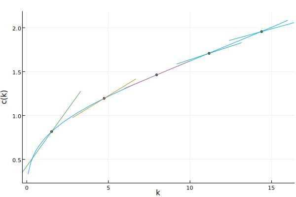

# Continuous-time demonstration of the "Exact Present Solution" method in Julia

This repository contains a simple, self-contained demonstration of the method outlined in [Den Haan, Kobielarz, and Rendahl (2015)](http://www.wouterdenhaan.com/papers/ET.pdf), for the continuous-time deterministic Ramsey model, written in Julia.

## Prerequisites

Familiarity with the Ramsey model, numerical methods, and Julia.

## Organization

- [doc/](./doc/) contains the writeup in LaTeX & PDF.
- [src/](./src/) has the Julia source.
- [fig/](./fig/) has the figures.

## Key figure

## Bibliography

Den Haan, Wouter J., Michal L. Kobielarz, and Pontus Rendahl. Exact present solution with consistent future approximation: A gridless algorithm to solve stochastic dynamic models. No. 1536. 2015.
